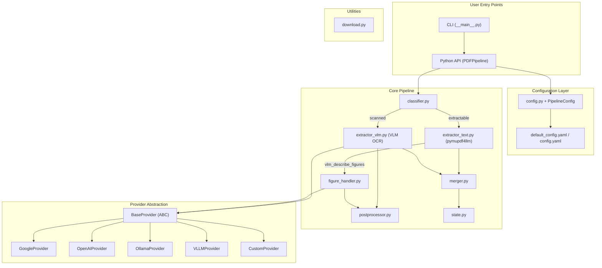

# Universal PDF-to-Markdown Extraction Pipeline

A Python library for intelligently extracting text and images from PDFs (both text-based and scanned) into structured Markdown. Features a VLM (Vision-Language Model) pipeline for scanned documents and figure descriptions.

## Quick Start

### 1. Install Dependencies
```bash
pip install PyMuPDF pymupdf4llm PyYAML aiohttp
```

### 2. Basic Python Usage

You can use the pipeline directly in your Python code without needing a `config.yaml` file by passing all configuration variables as kwargs. 

Here is a comprehensive code sample containing all available config variables:

```python
import os
from pdf_extraction import PDFPipeline

# Optional: Set your API key in the environment before running
os.environ["GEMINI_API_KEY"] = "your_actual_api_key_here"

# Initialize Pipeline with direct kwargs (no config.yaml needed!)
pipeline = PDFPipeline(
    # --- Classification ---
    classification_min_chars_per_page=600,   # Min text characters to consider a page "extractable"
    classification_max_image_coverage=0.80,  # If an image covers >80% of page, flag as scanned
    classification_strategy="sample",        # "first_page" (fast) or "sample" (more accurate)

    # --- Provider Setup ---
    provider_name="google",                  # Active provider ("google", "openai", "ollama", "vllm", "custom")
    provider_model="gemini-3.1-flash-lite",       # Target VLM model (e.g., "gpt-4o", "gemini-2.0-flash")
    provider_base_url=None,                  # Optional override for the API base URL
    provider_api_key=None,                   # Pass key directly, or leave None to read from os.environ

    # Custom provider settings (ignored unless provider_name="custom")
    custom_base_url="http://localhost:8000/v1",
    custom_api_key="",
    custom_model="my-model",
    custom_headers={},                       # Extra HTTP headers dict
    custom_supports_batch=False,             # Does the custom endpoint support multi-image requests?

    # --- VLM / OCR Behavior ---
    vlm_describe_figures=True,               # Use VLM to describe diagrams/photos in text-based PDFs
    vlm_page_batching="single",              # "single" (1 request per page) or "batch"
    vlm_max_pages_per_batch=10,              # Max images per API call in batch mode
    vlm_max_concurrent_requests=5,           # Max parallel API requests
    vlm_max_concurrent_documents=3,          # Max parallel documents processed when running a directory
    vlm_timeout_seconds=120,                 # Network timeout in seconds
    vlm_render_dpi=200,                      # Resolution (DPI) to render PDF pages as images
    vlm_optional_prompt="Output in English", # Extra instructions for the AI
    vlm_max_output_tokens=8192,              # Max tokens the VLM may output per request

    # --- Cost Estimation ---
    cost_enabled=True,                       # Estimate API costs before processing
    cost_warn_threshold_usd=5.00,            # Warning threshold limit for cost estimation
    cost_price_per_image=None,               # Manual cost per page ($). Leaves None to auto-detect.

    # --- Output & Logging ---
    output_directory="./output/documents",   # Where to save the output Markdown files
    output_state_directory="./output/state", # Where to save resume/progress trackers
    output_filename_strategy="original",     # "original" (keeps name) or "url_hash" (SHA-256 hash)
    logging_level="INFO",                    # "DEBUG", "INFO", "WARNING", "ERROR"
    logging_log_classification_details=True, # Print page metrics to console
    logging_log_file=None,                   # Optional path to write a log file

    # --- Post-Processing ---
    postprocessing_enabled=True,             # Enable automatic cleanup of the generated markdown
    postprocessing_strip_code_wrappers=True, # Removes ```markdown formatting wrappers
    postprocessing_normalize_whitespace=True,# Collapses excessive blank lines
    postprocessing_fix_table_alignment=True, # Automatically aligns Markdown table columns
    postprocessing_normalize_headings=True   # Fixes nested headings that start below H1
)

# Process a document
result = pipeline.process("my_document.pdf")

if result.status == "completed":
    print(f"✅ Success! Extracted to: {result.output_path}")
else:
    print(f"❌ Failed: {result.error}")
```

## Running via CLI
You can also run the pipeline directly via the command line:
```bash
python -m pdf_extraction -i my_document.pdf
```
*Note: CLI execution relies on `config.yaml` or default settings.*

## Architecture



- **Extractable PDFs (Text-Based)**: Uses `pymupdf4llm` to instantly convert native text/tables directly to Markdown offline.
- **Scanned PDFs (Image-Based)**: Renders pages into images and sends them to a cloud or local Vision model (e.g. Gemini, GPT-4o, Ollama) for OCR conversion.
- **Figures**: Automatically crops charts/diagrams and translates them into semantic descriptions using AI blockquotes.
